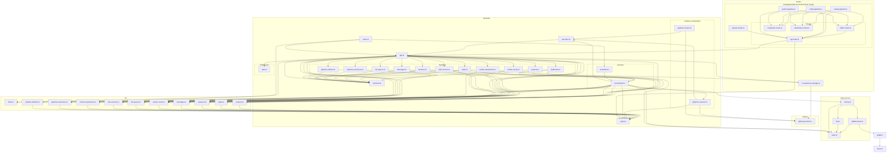

# TypeScript Graph

```bash
tsg --exclude node_modules utils
```


```mermaid
flowchart
    subgraph db["db"]
        db/client.ts["client.ts"]
        db/projects.ts["projects.ts"]
        db/tasks.ts["tasks.ts"]
        db/sessions.ts["sessions.ts"]
        db/messages.ts["messages.ts"]
        db/worker//cache.ts["worker-cache.ts"]
        db/file//spaces.ts["file-spaces.ts"]
        db/task//sources.ts["task-sources.ts"]
        db/worker//repositories.ts["worker-repositories.ts"]
        db/pipeline//executions.ts["pipeline-executions.ts"]
        db/pipeline//artifacts.ts["pipeline-artifacts.ts"]
    end
    subgraph backend_["backend"]
        backend_/types.ts["types.ts"]
        backend_/schemas.ts["schemas.ts"]
        backend_/api//client.ts["api-client.ts"]
        backend_/app.ts["app.ts"]
        backend_/index.ts["index.ts"]
        subgraph backend_/handlers["/handlers"]
            backend_/handlers/projects.ts["projects.ts"]
            backend_/handlers/tasks.ts["tasks.ts"]
            backend_/handlers/sessions.ts["sessions.ts"]
            backend_/handlers/messages.ts["messages.ts"]
            backend_/handlers/worker//cache.ts["worker-cache.ts"]
            backend_/handlers/file//spaces.ts["file-spaces.ts"]
            backend_/handlers/task//sources.ts["task-sources.ts"]
            backend_/handlers/worker//repositories.ts["worker-repositories.ts"]
            backend_/handlers/pipeline//executions.ts["pipeline-executions.ts"]
            backend_/handlers/pipeline//artifacts.ts["pipeline-artifacts.ts"]
            backend_/handlers/webhooks.ts["webhooks.ts"]
        end
        subgraph backend_/worker//orchestration["/worker-orchestration"]
            backend_/worker//orchestration/pipeline//executor.ts["pipeline-executor.ts"]
            backend_/worker//orchestration/pipeline//monitor.ts["pipeline-monitor.ts"]
        end
        subgraph backend_/services["/services"]
            backend_/services/orchestrator.ts["orchestrator.ts"]
            backend_/services/scheduler.ts["scheduler.ts"]
        end
        subgraph backend_/middleware["/middleware"]
            backend_/middleware/auth.ts["auth.ts"]
        end
    end
    subgraph shared["shared"]
        shared/gitlab//api//client.ts["gitlab-api-client.ts"]
    end
    subgraph task//sources["task-sources"]
        task//sources/base.ts["base.ts"]
        task//sources/gitlab//issues.ts["gitlab-issues.ts"]
        task//sources/jira.ts["jira.ts"]
        task//sources/factory.ts["factory.ts"]
    end
    subgraph worker["worker"]
        worker/ci//repository//manager.ts["ci-repository-manager.ts"]
        subgraph worker/templates/2025//10//18//01/worker//scripts["/templates/2025-10-18-01/worker-scripts"]
            worker/templates/2025//10//18//01/worker//scripts/claude//pipeline.ts["claude-pipeline.ts"]
            worker/templates/2025//10//18//01/worker//scripts/codex//pipeline.ts["codex-pipeline.ts"]
            worker/templates/2025//10//18//01/worker//scripts/gemini//pipeline.ts["gemini-pipeline.ts"]
            worker/templates/2025//10//18//01/worker//scripts/upload//results.ts["upload-results.ts"]
            subgraph worker/templates/2025//10//18//01/worker//scripts/shared["/shared"]
                worker/templates/2025//10//18//01/worker//scripts/shared/api//client.ts["api-client.ts"]
                worker/templates/2025//10//18//01/worker//scripts/shared/traffic//check.ts["traffic-check.ts"]
                worker/templates/2025//10//18//01/worker//scripts/shared/completion//check.ts["completion-check.ts"]
                worker/templates/2025//10//18//01/worker//scripts/shared/clarification//check.ts["clarification-check.ts"]
            end
        end
    end
    db/projects.ts-->backend_/types.ts
    backend_/handlers/projects.ts-->db/projects.ts
    backend_/handlers/projects.ts-->backend_/schemas.ts
    db/tasks.ts-->backend_/types.ts
    backend_/handlers/tasks.ts-->db/tasks.ts
    backend_/handlers/tasks.ts-->backend_/schemas.ts
    db/sessions.ts-->backend_/types.ts
    backend_/handlers/sessions.ts-->db/sessions.ts
    backend_/handlers/sessions.ts-->backend_/schemas.ts
    db/messages.ts-->backend_/types.ts
    backend_/handlers/messages.ts-->db/messages.ts
    backend_/handlers/messages.ts-->backend_/schemas.ts
    db/worker//cache.ts-->backend_/types.ts
    backend_/handlers/worker//cache.ts-->db/worker//cache.ts
    db/file//spaces.ts-->backend_/types.ts
    backend_/handlers/file//spaces.ts-->db/file//spaces.ts
    backend_/handlers/file//spaces.ts-->backend_/schemas.ts
    db/task//sources.ts-->backend_/types.ts
    db/worker//repositories.ts-->backend_/types.ts
    backend_/worker//orchestration/pipeline//executor.ts-->backend_/types.ts
    backend_/worker//orchestration/pipeline//executor.ts-->backend_/api//client.ts
    backend_/worker//orchestration/pipeline//executor.ts-->shared/gitlab//api//client.ts
    gitlab.ts-->issue.ts
    task//sources/gitlab//issues.ts-->task//sources/base.ts
    task//sources/gitlab//issues.ts-->gitlab.ts
    task//sources/jira.ts-->task//sources/base.ts
    task//sources/factory.ts-->task//sources/base.ts
    task//sources/factory.ts-->task//sources/gitlab//issues.ts
    task//sources/factory.ts-->task//sources/jira.ts
    backend_/services/orchestrator.ts-->db/tasks.ts
    backend_/services/orchestrator.ts-->db/projects.ts
    backend_/services/orchestrator.ts-->db/task//sources.ts
    backend_/services/orchestrator.ts-->db/file//spaces.ts
    backend_/services/orchestrator.ts-->db/worker//repositories.ts
    backend_/services/orchestrator.ts-->db/sessions.ts
    backend_/services/orchestrator.ts-->db/worker//cache.ts
    backend_/services/orchestrator.ts-->backend_/worker//orchestration/pipeline//executor.ts
    backend_/services/orchestrator.ts-->backend_/api//client.ts
    backend_/services/orchestrator.ts-->backend_/types.ts
    backend_/services/orchestrator.ts-->task//sources/base.ts
    backend_/services/orchestrator.ts-->task//sources/factory.ts
    backend_/handlers/task//sources.ts-->db/task//sources.ts
    backend_/handlers/task//sources.ts-->backend_/services/orchestrator.ts
    backend_/handlers/task//sources.ts-->backend_/schemas.ts
    worker/ci//repository//manager.ts-->shared/gitlab//api//client.ts
    backend_/handlers/worker//repositories.ts-->db/worker//repositories.ts
    backend_/handlers/worker//repositories.ts-->db/projects.ts
    backend_/handlers/worker//repositories.ts-->worker/ci//repository//manager.ts
    backend_/handlers/worker//repositories.ts-->backend_/schemas.ts
    db/pipeline//executions.ts-->backend_/types.ts
    backend_/handlers/pipeline//executions.ts-->db/pipeline//executions.ts
    backend_/handlers/pipeline//executions.ts-->backend_/schemas.ts
    db/pipeline//artifacts.ts-->backend_/types.ts
    backend_/handlers/pipeline//artifacts.ts-->db/pipeline//artifacts.ts
    backend_/handlers/pipeline//artifacts.ts-->backend_/schemas.ts
    backend_/handlers/webhooks.ts-->backend_/services/orchestrator.ts
    backend_/handlers/webhooks.ts-->db/task//sources.ts
    backend_/handlers/webhooks.ts-->task//sources/base.ts
    backend_/app.ts-->db/client.ts
    backend_/app.ts-->backend_/handlers/projects.ts
    backend_/app.ts-->backend_/handlers/tasks.ts
    backend_/app.ts-->backend_/handlers/sessions.ts
    backend_/app.ts-->backend_/handlers/messages.ts
    backend_/app.ts-->backend_/handlers/worker//cache.ts
    backend_/app.ts-->backend_/handlers/file//spaces.ts
    backend_/app.ts-->backend_/handlers/task//sources.ts
    backend_/app.ts-->backend_/handlers/worker//repositories.ts
    backend_/app.ts-->backend_/handlers/pipeline//executions.ts
    backend_/app.ts-->backend_/handlers/pipeline//artifacts.ts
    backend_/app.ts-->backend_/handlers/webhooks.ts
    backend_/app.ts-->backend_/middleware/auth.ts
    backend_/app.ts-->db/sessions.ts
    backend_/app.ts-->db/messages.ts
    backend_/app.ts-->db/pipeline//executions.ts
    backend_/app.ts-->db/pipeline//artifacts.ts
    backend_/app.ts-->db/worker//repositories.ts
    backend_/app.ts-->db/projects.ts
    backend_/app.ts-->db/worker//cache.ts
    backend_/app.ts-->worker/ci//repository//manager.ts
    backend_/app.ts-->backend_/schemas.ts
    backend_/api//client.ts-->backend_/app.ts
    backend_/services/scheduler.ts-->backend_/services/orchestrator.ts
    backend_/index.ts-->backend_/app.ts
    backend_/index.ts-->backend_/services/scheduler.ts
    backend_/index.ts-->db/client.ts
    backend_/worker//orchestration/pipeline//monitor.ts-->backend_/api//client.ts
    backend_/worker//orchestration/pipeline//monitor.ts-->shared/gitlab//api//client.ts
    worker/templates/2025//10//18//01/worker//scripts/shared/api//client.ts-->backend_/app.ts
    worker/templates/2025//10//18//01/worker//scripts/shared/api//client.ts-->backend_/types.ts
    worker/templates/2025//10//18//01/worker//scripts/shared/traffic//check.ts-->worker/templates/2025//10//18//01/worker//scripts/shared/api//client.ts
    worker/templates/2025//10//18//01/worker//scripts/claude//pipeline.ts-->worker/templates/2025//10//18//01/worker//scripts/shared/api//client.ts
    worker/templates/2025//10//18//01/worker//scripts/claude//pipeline.ts-->worker/templates/2025//10//18//01/worker//scripts/shared/traffic//check.ts
    worker/templates/2025//10//18//01/worker//scripts/claude//pipeline.ts-->worker/templates/2025//10//18//01/worker//scripts/shared/completion//check.ts
    worker/templates/2025//10//18//01/worker//scripts/claude//pipeline.ts-->worker/templates/2025//10//18//01/worker//scripts/shared/clarification//check.ts
    worker/templates/2025//10//18//01/worker//scripts/codex//pipeline.ts-->worker/templates/2025//10//18//01/worker//scripts/shared/api//client.ts
    worker/templates/2025//10//18//01/worker//scripts/codex//pipeline.ts-->worker/templates/2025//10//18//01/worker//scripts/shared/traffic//check.ts
    worker/templates/2025//10//18//01/worker//scripts/codex//pipeline.ts-->worker/templates/2025//10//18//01/worker//scripts/shared/completion//check.ts
    worker/templates/2025//10//18//01/worker//scripts/codex//pipeline.ts-->worker/templates/2025//10//18//01/worker//scripts/shared/clarification//check.ts
    worker/templates/2025//10//18//01/worker//scripts/gemini//pipeline.ts-->worker/templates/2025//10//18//01/worker//scripts/shared/api//client.ts
    worker/templates/2025//10//18//01/worker//scripts/gemini//pipeline.ts-->worker/templates/2025//10//18//01/worker//scripts/shared/traffic//check.ts
    worker/templates/2025//10//18//01/worker//scripts/gemini//pipeline.ts-->worker/templates/2025//10//18//01/worker//scripts/shared/completion//check.ts
    worker/templates/2025//10//18//01/worker//scripts/gemini//pipeline.ts-->worker/templates/2025//10//18//01/worker//scripts/shared/clarification//check.ts
    worker/templates/2025//10//18//01/worker//scripts/upload//results.ts-->worker/templates/2025//10//18//01/worker//scripts/shared/api//client.ts
```

